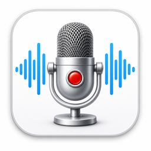

<p align="center">
  
</p>

<h1 align="center">Simple Voice Recorder</h1>

<p align="center">
  録る、聴く、残す。Windowsで軽快に使えるシンプルなボイスレコーダー。
</p>

<p align="center">
  
  
  
  
</p>

<p align="center">
  <a href="https://github.com/aki-sho/simple-voice-recorder/releases/latest"><strong>最新版をダウンロード</strong></a>
  ・
  <a href="#主な機能">主な機能</a>
  ・
  <a href="#開発環境での起動">開発者向け情報</a>
</p>

## 概要

Simple Voice Recorderは、TauriとHTML/CSS/JavaScriptで作られたWindows向けの
軽量ボイスレコーダーです。録音、保存、再生、削除をオフラインで行えます。
常駐処理、スタートアップ登録、レジストリ利用は行いません。

現在のバージョン: `1.0.0`

## ダウンロード

| 用途 | ファイル |
| --- | --- |
| 通常インストール（おすすめ） | [`Simple-Voice-Recorder-Setup-1.0.0.exe`](https://github.com/aki-sho/simple-voice-recorder/releases/latest/download/Simple-Voice-Recorder-Setup-1.0.0.exe) |
| インストール不要 | [`Simple-Voice-Recorder-Portable-1.0.0.zip`](https://github.com/aki-sho/simple-voice-recorder/releases/latest/download/Simple-Voice-Recorder-Portable-1.0.0.zip) |
| 単体ポータブルEXE | [`Simple-Voice-Recorder-Portable-1.0.0.exe`](https://github.com/aki-sho/simple-voice-recorder/releases/latest/download/Simple-Voice-Recorder-Portable-1.0.0.exe) |

初めて使う場合はインストール版、USBメモリや任意のフォルダから使う場合は
ポータブルZIPを選んでください。各ファイルのSHA-256はReleaseに添付しています。

## 主な機能

- マイク録音の開始・停止
- 録音状態と録音時間の表示
- 録音中の開始ボタン無効化、待機中の停止ボタン無効化
- 録音ファイルの保存先フォルダ選択と設定保持
- 既定の保存形式の選択と設定保持
- 日時を使ったファイル名の自動生成
- 保存済み録音の一覧表示
- 再生、一時停止、停止、再生位置変更
- 確認ダイアログ付きの録音ファイル削除
- 保存先消失時、マイク拒否時、マイク未接続時のエラー表示

## 対応する音声形式

- WebM: WebView2の`MediaRecorder`が対応する環境ではOpus音声
- MP3: 128 kbps、モノラル

ファイル名の例:

```text
recording_2026-06-13_153000.webm
recording_2026-06-13_153000.mp3
```

## 録音ファイルの保存場所

録音ファイルは、アプリの「保存先を選択」でユーザーが指定したフォルダへ
保存されます。保存先が未設定の場合は、録音停止時にフォルダ選択画面を
表示します。

## 設定とデータの保存場所

インストール版:

```text
%APPDATA%\Simple Voice Recorder\
├─ settings.json
└─ WebView\
```

ポータブル版:

```text
<ポータブルEXEのフォルダ>\Simple-Voice-Recorder-PortableData\
├─ settings.json
└─ WebView\
```

`settings.json`には録音ファイルの保存先と既定の保存形式を保存します。
ポータブル版の設定場所はEXE名ではなく、専用ビルドのコンパイル設定で
決まります。v0.1.0のEXE横にある`data\settings.json`は、初回起動時に
新しいポータブル設定フォルダへ移行されます。

## 必要な動作環境

- Windows 10 / 11（64ビット）
- マイク
- Microsoft Edge WebView2 Runtime

ポータブル版はWebView2 Runtimeを同梱しません。インストール版は、
WebView2がない場合にEvergreen Bootstrapperをダウンロードできます。

## 開発環境での起動

開発に必要なもの:

- Node.js 20以降とnpm
- Rust stable（MSVC toolchain）
- Microsoft C++ Build Tools
- Microsoft Edge WebView2 Runtime

依存パッケージをインストールして起動します。

```powershell
npm install
npm run dev
```

ポータブルモードの設定場所を確認する場合:

```powershell
npm run portable:dev
```

フロントエンドは`src`の静的ファイルを直接読み込むため、Viteなどの
追加ビルドツールは使用しません。

## Windows向けビルド

通常のTauriビルド:

```powershell
npm run build
```

従来どおり、次のコマンドでも同じTauriビルドを実行できます。

```powershell
npm run tauri build
```

主な生成場所:

```text
src-tauri\target\release\simple-voice-recorder.exe
src-tauri\target\release\bundle\nsis\*.exe
```

インストーラー、ポータブルEXE、ポータブルZIP、SHA-256をまとめて作る場合:

```powershell
npm run release:windows
```

生成済みのReleaseファイルを検証する場合:

```powershell
npm run verify:release
```

## 配布ファイル

`npm run release:windows`の出力:

```text
dist\
├─ Simple-Voice-Recorder-Setup-1.0.0.exe
├─ Simple-Voice-Recorder-Setup-1.0.0.exe.sha256
├─ Simple-Voice-Recorder-Portable-1.0.0.exe
├─ Simple-Voice-Recorder-Portable-1.0.0.exe.sha256
├─ Simple-Voice-Recorder-Portable-1.0.0.zip
└─ Simple-Voice-Recorder-Portable-1.0.0.zip.sha256
```

ポータブルZIPの内容:

```text
Simple-Voice-Recorder-Portable-1.0.0\
├─ Simple-Voice-Recorder-Portable-1.0.0.exe
└─ README.txt
```

配布ファイルはGitリポジトリへコミットせず、GitHub Releaseへ添付します。
Releaseタグは`v1.0.0`です。リリース本文は
[`RELEASE_NOTES_v1.0.0.md`](RELEASE_NOTES_v1.0.0.md)を使用できます。

## 注意点

- マイク利用時にWindowsの許可確認が表示される場合があります。
- Windowsのマイク設定でデスクトップアプリの利用が無効の場合は録音できません。
- 録音中にアプリを終了すると、その録音は保存されません。
- 保存先フォルダを移動または削除した場合は、保存先を選び直してください。
- ポータブル版は書き込み可能なフォルダへ置いてください。
- コード署名は含まれていないため、SmartScreenの警告が出る場合があります。

## ライセンス

このプロジェクトは[MIT License](LICENSE)で公開します。

第三者ライブラリと各ライセンスは
[`THIRD_PARTY_NOTICES.md`](THIRD_PARTY_NOTICES.md)を参照してください。
MP3エンコードには`lamejs` 1.2.1（LGPL-3.0）を使用しています。

## GitHub Release

Project: https://github.com/aki-sho/simple-voice-recorder

Release tag: `v1.0.0`
